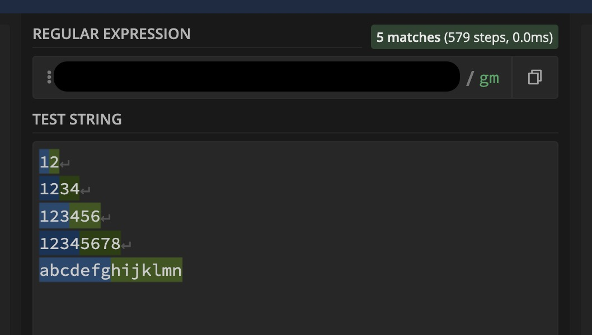

# 2024

## 1.1

元旦摆烂

## 1.2

元旦调休摆烂

## 1.3

## 1.4

## 1.5

一个效果

<https://codepen.io/wheatup/pen/PoLZLXZ/a340269f2d6ebcfc371994574e396ea1?editors=1100>

## 1.6

1. 2023 年 github 涨星最快的项目

<https://risingstars.js.org/2023/en#section-all>

挑几个看了看

- shadcn/ui 用 React 编写的 UI 组件的集合，允许通过 TailwindCSS 进行自定义样式。与传统的组件库不同的是 他不是通过 npm 安装而是通过 CLI 交付，该 CLI 将组件的源代码放入项目本身。

> 为什么复制/粘贴而不打包为依赖项？
> 其背后的想法是赋予您对代码的所有权和控制权，允许您决定如何构建组件和设计样式。
> 从一些合理的默认值开始，然后根据您的需要自定义组件。
> 将组件打包在 npm 包中的缺点之一是样式与实现耦合。组件的设计应该与其实现分开。

- 手绘的虚拟白板（画板，canvas），项目地址 <https://excalidraw.com> <https://www.tldraw.com>
- Tarui 移动端构建

> vue 生态
> 随着 Vue 2 宣布将于 2023 年底停用，今年被认为是 Vue 及其社区的转折点，我们中的许多人开始了升级到版本 3 的旅程。
> 在这方面，我们努力帮助迁移，生态系统迎头赶上并不断发展：它显示出了巨大的成果！Nuxt 3 现在的下载量比 Nuxt 2 更多。UI 框架（如 Vuetify 和 PrimeVue）比以往任何时候都更容易帮助构建大型（和较小的！）应用程序。VueUse、Pinia 甚至 TresJS 等库不断发展和增强自身，以更好地为我们所有人提供支持。
>
> 与 2022 年一样，开发者体验仍然是重中之重。Vue 3.3 改进了对`<script setup>`. Nuxt 发布了 8 个小版本，并推出了 Nuxt DevTools，这是一个富有创意且富有洞察力的 UI，可以帮助我们更好地理解我们的应用程序并更快地开发它们。
>
> 展望未来，正如 Evan 所说，2024 年对于 Vue 来说将是激动人心的一年。Vue 3.4 即将到来，Vapor 模式现已开源，进展顺利。所有这些都在新的一年中进行了调整，以实现更多的性能改进和社区创新。

- Nuxt
- slidev vue 幻灯片 <https://sli.dev/guide/why.html>

> 构建工具
> Bun 也是一个捆绑器，因此我们今年将其纳入“构建工具”类别。
>
> 两年后，Vite 仍然是最受欢迎的多功能捆绑器，为 Astro、Nuxt、Remix、SolidStart、SvelteKit 等元框架提供支持...
>
> 11 月发布的版本 5 建立在 rollup 4 之上，带来了性能改进。
>
> Evan You 宣布他正在开发 Rolldown，这是 Rust 中 Rollup 的一个端口，将集成到 Vite 中。所以 Vite 的未来是光明的！
>
> 三季度的时候 Biome 的崛起是今年的故事之一。它与 Roma 的陷落有关，这是一个雄心勃勃的项目，旨在统一工具（编译、linting、格式化、捆绑、测试）。该项目背后的公司失败了，该项目今年被叫停。
>
> 幸运的是，该项目被分叉并以 Biome 的名义重生。
>
> 11 月，Biome 赢得了 Prettier 挑战：创建“一个基于 Rust 的代码格式化程序，可以通过超过 95% 的 Prettier 测试”。Prettier 是这样一个标准，我们预计 2024 年 Biome 会有更多采用。
>
> 说到 Rust，Oxc 和 Rspack 是这个领域的新玩家，来自字节跳动团队。 Rspack 提供与 Webpack 的兼容性，同时提供无与伦比的性能。自从我们举办新星评选以来，这是第一次，考虑到使用 Webpack 的项目数量，在排名中没有看到 Webpack 是很奇怪的！

- Bun
- vite
- Biome
- Rspack 字节的
- Turborepo 当初号称比 vite 快十倍的
- swc Rust 版 babel

> 测试工具

- Playwright 微软出的一个测试工具
- Storybook UI 测试工具 <https://storybook.js.org/>
- Puppteer 无头浏览器
- vitest

2. 比较有意思的 MySql 将会引入`javascript`的语法 <https://blogs.oracle.com/mysql/post/introducing-javascript-support-in-mysql>
3. RSC 比较清晰的一个讲解： <https://juejin.cn/post/7254901061176950844>
4. 一个外网的 vite 课程 :<https://frontendmasters.com/courses/vite/> 想办法搞个翻译的

## 1.7

## 1.8

1. subtree 拉取代码报错

背景是这样 A 项目 使用了 subtreeA B 项目也使用了 subtreeA
A 提交了一些 commit 到 A 分支 B 项目也需要对子项目更改，但是它没有拉取 A 项目的提交，然后直接提交
A 项目去拉取代码的时候 报错下面的。

subtree: Can't squash-merge: 'foo' was never added.

<https://stackoverflow.com/questions/9777564/git-subtree-pull-complications>

我们最简单的方法是 删除 A 项目的 tree 重新 ADD 一下。

2. vite 依赖预构建相关

场景是这样，我们有一个组件库，然后一个项目，当项目修改需要修改组件库时，通过 npm link / 发包的形式 在项目中使用，但是

## 1.9

1. vite 的项目有啥插件可以访问 alias 的路径（import api from "@/api"）内容吗？现在鼠标放上去不能跳转了

ts config 配置 `/// <reference types="vite/client" />`
js config 配置

```json
{
  "compilerOptions": {
    "baseUrl": ".",
    "paths": {
      "@/*": ["src/*"]
    }
  },
  "include": ["src/**/*", "src/**/*.{js,jsx,vue}"],
  "exclude": ["node_modules", "dist", "createVueTemplate", "dll", "public"]
}
```

2. 题目

```js
const group = (arr, count) => {
  /* 代码 */
};

const input = [1, 2, 3, 4, 5, 6, 7, 8, 9, 10, 11, 12, 13, 14, 15];

group(input, 4);
// 输出
[
  [1, 2, 3, 4],
  [5, 6, 7, 8],
  [9, 10, 11, 12],
  [13, 14, 15],
];
```

解法

```js
const group = (arr, count) =>
  arr.flatMap((v, i) => (i % count ? [] : [input.slice(i, i + count)]));

const group = (arr, count) =>
  Object.values(Object.groupBy(arr, (_, i) => ~~(i / count)));

const group = (arr, count) =>
  arr.reduce(
    (result, _, index) => (
      (result[(index / count) >> 0] ||= []).push(arr[index]), result
    ),
    []
  );
```

3. ra2 协议

## 1.10

1. subtree 的问题

会遇到`rev-parse split hash commitId1 from commit2` 这种报错 ，是另一个人提交了 split，在当前分支后，所以葱新的 commit 去递归找不到信息，所以需要先 pull 一下 再去 push

遇到`working tree has modifications . cannot add` 这种事拉下来冲突了 或者拉下来代码 只是放在了缓存区 需要手动 commit push

2. uni-app 组件样式穿透

页面级的可以去修改组件的样式 ， 组件无法修改组件的样式。如果想改 ，通过全局 css 文件去改。

## 1.11

1. promise.reject(reason) 如果不是 Error 会有警告，

通过修改 eslint 规则 `'prefer-promise-reject-errors': 'off'` 取消掉该报错。

## 1.12

1. vite 依赖预构建

指的是在 DevServer 启动之前，Vite 会扫描使用到的依赖从而进行构建，之后在代码中每次导入(import)时会动态地加载构建过的依赖这一过程

vite 启动项目时，项目 node_modules 目录下会额外增加一个 node_modules/.vite/deps,这个目录就是 vite 在开发环境下预编译的产物。

项目中的依赖部分： ahooks、antd、react 等部分会被预编译成为一个一个 .js 文件。

同时，.vite/deps 目录下还会存在一个 \_metadata.json,\_metadata.json 的文件用来保存预编译阶段生成文件的映射关系(optimized 字段)，方便在开发环境运行时重写依赖路径。

为什么需要预构建 ?

首先第一点，我们都清楚 Vite 是基于浏览器 Esmodule 进行模块加载的方式。

那么，对于一些非 ESM 模块规范的第三方库，比如 react。在开发阶段，我们需要借助预构建的过程将这部分非 esm 模块的依赖模块转化为 esm 模块。从而在浏览器中进行 import 这部分模块时也可以正确识别该模块语法。

另外一个方面，同样是由于 Vite 是基于 Esmodule 这一特性。在浏览器中每一次 import 都会发送一次请求，部分第三方依赖包中可能会存在许多个文件的拆分从而导致发起多次 import 请求。

比如 lodash-es 中存在超过 600 个内置模块，当我们执行 import { debounce } from 'lodash' 时，如果不进行预构建浏览器会同时发出 600 多个 HTTP 请求，这无疑会让页面加载变得明显缓慢。

通过依赖预构建，将 lodash-es 预构建成为单个模块后仅需要一个 HTTP 请求就可以解决上述的问题。

基于上述两点，Vite 中正是为了模块兼容性以及性能这两方面大的原因，所以需要进行依赖预构建。

> 如果出于某些原因你想要强制 Vite 重新构建依赖项，你可以在启动开发服务器时指定 --force 选项，或手动删除 node_modules/.vite 缓存目录。

**遇到的问题**

如果我们有两个项目，主项目 A 与组件库项目 B，某次需求我需要去修改项目 A 与 组件库 B ， 我希望在 A 中修改 B（不管是那种方式）当我更改了`node_modules`中 B 项目代码，期望是可以 A 项目自动刷新 并运用更改后的 B 代码。

主要的问题其实有两点，一是我们需要吧 B 项目 从预构建中剔除掉，二是我们需要在`node_modules`变化时热更新一下

剔除的方法：`vite.config.js`中有配置是`optimizeDeps`可以指定不预构建和构建某些地址的文件。

比如

```js
export default defineConfig({
  optimizeDeps: {
    // 预构建某些
    include: ["esm-dep > cjs-dep"],
    // 或者忽略某些
    exlude: [],
    // 强制不使用预构建
    force: true,
  },
});
```

监听更改后代码的方法：

> 目前没有可行的方式来监听 node_modules 中的文件。若要了解更多详情和可能的临时替代方案，你可以关注 issue #8619<https://github.com/vitejs/vite/issues/8619>。

原文文档地址：
https://cn.vitejs.dev/config/server-options.html#server-watch

除了上面这几种方法，anfu 大佬开发了一个插件<https://github.com/antfu/vite-plugin-restart/issues/10>

是否可用暂时没有试。

2. Select 遇到的一个小问题

```html
<div id="app">
  <textarea id="summary" cols="30" rows="10">
    Hello how are you!
  </textarea>
  <div>
    <button type="button">Select From Textarea & Just Click</button>
    <a href="#">Select Text From Textarea & Just Click</a>
  </div>
</div>

<script>
  const summary = document.getElementById("summary");
  summary?.addEventListener("select", (e) => {
    console.log("listening to select event...");
  });
</script>
```

现象是这样的 先选中一段 然后去点击按钮 此时也会触发输出 (只在 chrome 出现)

## 1.15

## 1.16

1. 可选链函数调用 `a?.()`
2. 在浏览器环境执行 node,`webcontainer`<https://juejin.cn/post/7250009632253411365>
3. vscode 源码各种看解析的 <https://juejin.cn/post/7235847450765836348#heading-12>
4. uni app 新版本 极验插件失效

## 1.17

1. 大佐分享的一个权限管理

```js
const Permissions = {
  VIEW: 1,
  SUBMIT: 2,
  EDIT: 4,
  MANAGEMENT: 8,
};

const { VIEW, SUBMIT, EDIT, MANAGEMENT } = Permissions;

const guest = VIEW;
const user = VIEW | SUBMIT | EDIT;
const admint = VIEW | SUBMIT | EDIT | MANAGEMENT;

const hasPermission = (role, permission) => !!(role & permission);
console.log(hasPermission(guest, EDIT));
console.log(hasPermission(admin, EDIT));
```

2. 一个插件 `import cost` 计算引入包的体积
3. localstorage.clear 间接调用会报错。

```js
const clear = localStorage.clear;
clear();
// 报错 this上下文丢了，调用会报错
```

## 1.23

1. console-delight 我们可以在控制台做彩蛋
   <https://frontendmasters.com/blog/console-delight/>

2. 一个很好的 DEMO 结合和`view-transition` 和 `has`
   <https://codepen.io/web-dot-dev/pen/wvOzRPM>
3. `subgrid` `view-timeline` `@property` 等结合的一个 dmo
   <https://codepen.io/argyleink/pen/vYQQEmo>

4. 不作用于 SEO 的属性 `data-nosnippet <span data-nosnippet>This is sensitive information.</span>`
5. a11y 测试工具，插件 <https://github.com/pa11y/pa11y>
6. 关于尺寸设计的理念 <https://ishadeed.com/article/target-size/?utm_source=CSS-Weekly&utm_medium=newsletter&utm_campaign=issue-573-january-10-2023> 提升用户体验相关
7. 一个纯 css 进度条的视频可以配置中文字幕看 <https://www.youtube.com/watch?v=FWn8HBFQ4n4>
8. 中断 forEach 的方法

```js
// throw Error
const array = [-3, -2, -1, 0, 1, 2, 3];

try {
  array.forEach((it) => {
    if (it >= 0) {
      console.log(it);
      throw Error(`We've found the target element.`);
    }
  });
} catch (err) {}

// 修改长度

array.forEach((it) => {
  if (it >= 0) {
    console.log(it);
    array.length = 0;
  }
});

// 修改原数组
array.forEach((it, i) => {
  if (it >= 0) {
    console.log(it);
    // Notice the sinful line of code
    array.splice(i + 1, array.length - i);
  }
});
```

## 1.24

1. puppeteer 相关操作 <https://proxiesapi.com/articles/the-complete-puppeteer-cheatsheet>
2. codepen Top100 2023 <https://codepen.io/2023/popular>
3. React 相关的 可能会用到吧
   7 个顶级学习平台 <https://javascript.plainenglish.io/7-top-platforms-to-learn-react-for-free-f91a14b23ba7>  
   一步一步学习 react <https://www.freecodecamp.org/news/how-to-learn-react-step-by-step/>

## 1.25

1. 如何在 vue.config.js 引入 自定义 loader

```js
chainWebpack: (config) => {
  // my-loader为loader的别名，./src/myLoader.js是loader的位置
  config.resolveLoader.alias.set(
    "my-loader",
    path.resolve(__dirname, "./src/myLoader.js")
  );
  // 修改vue文件Loader的选项，增加新的处理loader
  const vueRule = config.module.rule("vue");
  vueRule.use("my-loader").loader("my-loader").end();
};
```

## 1.26

1. 多行文本圆角背景 <https://codepen.io/ines/pen/NXbmRO>

## 1.29

## 1.30

1. 嵌套使用的 ref 会自动解包

```js
const a = ref(1);
const b = ref({
  a,
});

const c = ref({
  b,
});

const d = ref({
  c,
});

console.log(d.value.c.b.a);

console.log(c.value.b.a);

console.log(b.value.a);
```

2. 多个 watchEffect 的执行顺序是 书写顺序
3. vue3 中 readonly 的使用场景？

## 1.31

1. 今日问题

```js
// 实现数字格式化，以万、亿为单位，最多展示4位有效数字
function formatNumber(num) {
  // your code
}

console.log(formatNumber(0)); // 0
console.log(formatNumber(1)); // 1
console.log(formatNumber(123)); // 123
console.log(formatNumber(1234)); // 1234
console.log(formatNumber(12345)); // 1.23万
console.log(formatNumber(123450)); // 12.35万
console.log(formatNumber(1234567)); // 123.5万
console.log(formatNumber(12345678)); // 1235万
console.log(formatNumber(123456789)); // 1.235亿

function formatNumber(num) {
  return new Intl.NumberFormat("zh", {
    maximumSignificantDigits: 4,
    notation: "compact",
  }).format(num);
}
```

## 2.2

1. 水文发现的一个 Array.map 比 Array.foreach 在 gzip 压缩的场景下 会小 3kb

```js

if (handlers) {
  (handlers as EventHandlerList<Events[keyof Events]>)
    .slice()
    .map((handler) => {
      handler(evt!);
    });
}

if (handlers) {
  (handlers as EventHandlerList<Events[keyof Events]>)
    .slice()
    .forEach((handler) => {
      handler(evt!);
    });
}

```

## 2.4service

1. eslint 的 extends 可以简写 比如`eslint-config-xxx` 可以简写为`xxx`
2. SaaS：一般用户使用你的在线服务
   PaaS：技术用户用你的平台来托管服务，但基建在你这儿
   IaaS：技术用户可以自己搞基建

## 2.5

1. a 为什么时 `(a== 1 && a==2 && a==3)` 为真

```js
const a = {
  i: 1,
  toString: function () {
    return a.i++;
  },
};

if (a == 1 && a == 2 && a == 3) {
  console.log("Hello World!");
}
```

```js
const a = [1, 2, 3];
a.join = a.shift;
console.log(a == 1 && a == 2 && a == 3);
```

```js
let i = 0;
let a = { [Symbol.toPrimitive]: () => ++i };

console.log(a == 1 && a == 2 && a == 3);
```

这个可能有点不合适

```js
var i = 0;

with ({
  get a() {
    return ++i;
  },
}) {
  if (a == 1 && a == 2 && a == 3) console.log("wohoo");
}
```

2. 图像相关的一个库 <https://js.cytoscape.org/>
3. typescript 5.4 更新 <https://devblogs.microsoft.com/typescript/announcing-typescript-5-4-beta/>

保留类型收缩的范围

```ts
function getUrls(url: string | URL, names: string[]) {
  if (typeof url === "string") {
    url = new URL(url);
  }

  return names.map((name) => {
    url.searchParams.set("name", name);
    //  ~~~~~~~~~~~~
    // error!
    // Property 'searchParams' does not exist on type 'string | URL'.

    return url.toString();
  });
}
```

TypeScript 5.4 利用这一点使缩小变得更加智能。当参数和变量在非提升 let 函数中使用时，类型检查器将查找最后一个赋值点。如果找到，TypeScript 可以安全地从包含函数的外部缩小范围。这意味着上面的例子现在可以工作了。

4. 小球下落 <https://sparkbox.github.io/bouncy-ball/#web-animations-api> 各种各样的 API

## 2.6

1. codepen 滚动相关 scroll-timeline `https://codepen.io/giana/pen/BabdgjB`
2. scroll-timeline 的用处介绍文章 `https://frontendmasters.com/blog/highlight-text-when-a-user-scrolls-down-to-that-piece-of-text/` 它是通过 scroll-timeline 当用户向下滚动到该文本时突出显示该文本
3. `text-wrap:balance`已经很熟悉不说了 ,`text-wrap:pretty` 它告诉浏览器使用更好但更慢的算法来流动文本。这旨在用于正文以提高可读性。 它提供的最受欢迎的好处可能是防止孤儿（孤儿是段落末尾的一个单词，它自己换成一行，这看起来有点尴尬）
4. 可变字体 <https://v-fonts.com/> 我们通常设置字体字重的时候 很多间隔是没有效果的，这是因为字体不支持。
5. text-area 正常情况下是不会根据输入内容高度变化的。提供一个库<https://github.com/andrico1234/autosize-textarea> 一个 css 解决方案: <https://css-tricks.com/the-cleanest-trick-for-autogrowing-textareas/>
6. WebGPU 的库 感觉永远用不到了 <https://jmberesford.github.io/webgpu-kit/>

7. javascript 中的 AO

在 JavaScript 中，AO 代表激活对象（Activation Object），是函数执行时创建的一个隐藏的数据结构。它包含了函数执行时所需的信息，包括：函数的参数，函数的局部变量，函数的执行上下文，函数的返回值
AO 是 JavaScript 函数执行机制的重要组成部分。它可以确保函数在执行时拥有独立的执行环境，并且不会相互影响。

## 2.7

1. 2023 年遇到的兼容性问题 https://juejin.cn/post/7309040097936343103

## 2.26

春节休假 20 天 摆大烂

1. 白屏检测(Mutation Observer)：

使用 Mutation Observer 来监听 DOM 变化，从而判断页面是否白屏。需要注意的是，判断页面是否白屏的阈值时间应该根据页面的实际情况来确定，如果设置时间太短可能会误判，设置时间太长可能会影响页面性能。

同时如果用户长时间未操作 DOM，Mutation Observer 监听到一定时间内没有 DOM 变化，就可能会误判为页面白屏。

Mutation Record 提供具体的 DOM 变更记录,可以支持白屏问题的回溯与定位。而检测根节点渲染无法提供问题的详细诊断信息。例如,如果一段时间内 DOM 变化只有删除元素操作,几乎没有新增或更新操作,可以判断可能存在删除逻辑错误导致白屏,这可以作为问题回溯的参考信息。
那如何利用 Mutation Observe 进行问题回溯呢？

2. 白屏检测(document.elementsFromPoint):

在我们的屏幕中，随机取几个固定的点，利用 document.elementsFromPoint（x,y）该函数返还在特定坐标点下的 HTML 元素数组。

```html
<!DOCTYPE html>
<html lang="en">
  <head>
    <meta charset="UTF-8" />
    <meta http-equiv="X-UA-Compatible" content="IE=edge" />
    <meta name="viewport" content="width=device-width, initial-scale=1.0" />
    <title>Document</title>
  </head>

  <body>
    <div class="main"></div>
    <script>
      function onload() {
        if (document.readyState === "complete") {
          whiteScreen();
        } else {
          window.addEventListener("load", whiteScreen);
        }
      }
      let wrapperElements = ["html", "body", ".content"]; //首先定义容器列表
      let emptyPoints = 0; //空白点数量
      function getSelector(element) {
        //获取节点的容器
        if (element.id) {
          return "#" + element.id;
        } else if (element.className) {
          //content main==> .content.main  主要为了处理类名是多个的情况
          return (
            "." +
            element.className
              .split(" ")
              .filter((item) => !!item)
              .join(".")
          );
        } else {
          return element.nodeName.toLowerCase();
        }
      }

      function isWrapper(element) {
        //判断关键点是否在wrapperElements定义的容器内
        let selector = getSelector(element);
        if (wrapperElements.indexOf(selector) != -1) {
          emptyPoints++; //如果采样的关键点是在wrapperElements容器内，则说明此关键点是空白点，则数量加1
        }
      }

      function whiteScreen() {
        for (let i = 1; i <= 9; i++) {
          let xElement = document.elementsFromPoint(
            (window.innerWidth * i) / 10,
            window.innerHeight / 2
          ); //在x轴方向上，取10个点
          let yElement = document.elementsFromPoint(
            window.innerWidth / 2,
            (window.innerHeight * i) / 10
          ); //在y轴方向上，取10个点
          isWrapper(xElement[0]);
          isWrapper(yElement[0]);
        }
        if (emptyPoints != 18) {
          //如果18个点不都是空白点，则说明页面正常显示
          clearInterval(window.loopFun);
          window.loopFun = null;
        } else {
          console.log("页面白屏了");
          if (!window.loopFun) {
            loop();
          }
        }
      }

      window.loopFun = null;

      function loop() {
        if (window.loopFun) return;
        window.loopFun = setInterval(() => {
          emptyPoints = 0;
          whiteScreen();
        }, 2000);
      }

      onload();
    </script>
    <script>
      let content = document.querySelector(".main");
      setTimeout(() => {
        content.style.width = "500px";
        content.style.height = "500px";
        content.style.backgroundColor = "red";
      }, 4000);
    </script>
  </body>
</html>
```

3. toggle 最常见的是`DOMTokenlist.toggle` 方法，这里的`DOMTokenList` 表示一组空格分割的标记，最常见的就是`Element.classList`

```html
<div class="a b c"></div>
```

通过`el.classList` 可以获取到 class 的详细信息

```js
el.classList.toggle("a"); // 移除 a
el.classList.toggle("a"); // 添加 a
```

通过上面这个，浏览器会动态判断，如果存在就移除，如果不存在就添加。

toggle 还支持第二个参数，表示强制，是一个布尔值，为 true 表示添加，反之为移除，而不管当前是什么状态

4. toggleAttribute 是用来切换属性的

比如控制一个输入框的禁用和开启。

```js
input.toggleAttribute("disable");

input.disabled = !input.disabled;

document.body.toggleAttribute("dark");

// 第二个参数表示强制
document.body.toggleAttribute("dark", ture); //添加dark属性
document.body.toggleAttribute("dark", false); //移除dark属性

// 也可以使用常规手段
document.body.setAttribute("dark", ""); //添加dark属性
document.body.removeAttribute("dark"); //移除dark属性
```

5. togglePopover 是新出来的，是针对 popover 元素推出的打开与关闭的方法。

```js
popoverEl.togglePopover(); //切换 popover
popoverEl.togglePopover(true); //打开 popover
popoverEl.togglePopover(false); //关闭 popover

// 打开
popoverEl.togglePopover(true);
// 等同于
popoverEl.showPopover();

// 关闭
popoverEl.togglePopover(false);
// 等同于
popoverEl.hidePopover();
```

6. toggle event
   这个也是跟随 poperver 推出的，可以通过 event 对象获取当前的新状态和旧状态，如下

```js
popover.addEventListener("toggle", (event) => {
  if (event.newState === "open") {
    console.log("Popover has been shown");
  } else {
    console.log("Popover has been hidden");
  }
});

// 有意思的是，这个事件同时也支持details元素
details.addEventListener("toggle", (event) => {});
```

7. 字节题

希望可以解构出来

```js
let [a, b] = { a: 1, b: 2 };

console.log(a, b); //TypeError: {(intermediate value)(intermediate value)} is not iterable
```

我们知道第一行等号左边的数组[a,b]是可迭代的，右边的对象{a:1,b:2}不可迭代的。那么我们应该‘使’命的想办法让右边的对象变成是可迭代的。既然对象身上没有迭代器属性，那我们就给它加一个！

```js
Object.prototype[Symbol.iterator] = function () {
  //Symbol.iterator属性返回的是函数
  return []; //此处应该返回的是一个迭代器对象，不是[]，直接{}也不可行
};
let [a, b] = { a: 1, b: 2 };

console.log(a, b); //TypeError: undefined is not a function
```

我们可以看到报的错不再是 not iterable,而是 undefined is not a function！这是因为 Symbol.iteratorreturn 出来的一个迭代器对象，所以这样也是不可行的。

再来，我们想数组的解构只能往数组解构，那么我们把对象转成数组，就是硬生生的把对象的值转为[1,2],也就是把值抠出来不要 key,那么此时才能解构成立。

```js
Object.prototype[Symbol.iterator] = function () {
  //Symbol.iterator属性返回的是函数
  //返回一个Array类型的可迭代对象
  return Object.values(this)[Symbol.iterator](); //this指向实例对象,Object.values(this)得到的是数组
};
let [a, b] = { a: 1, b: 2 }; //实例对象 相当于获得[1,2]

console.log(a, b); //1 2
```

## 2.27

1. 冬令时 / 夏令时 问题

比如德国在`2023-10-29`凌晨 3 点 会进入冬令时，即当我们时间到了 2:59 即将走完时，会自动跳转到 2:00, 此时当天就是 25 小时，如果我们计算第二天日期是选择当前时间+24h 的时间戳去做的话，会有问题。

所以需要我们去设置时间，setDate 这样。

另外`Date.getTimezoneOffset` 回在 UTC 时区中计算的此日期与在本地时区中计算的同一日期之间的差异（以分钟为单位）。 它是会自动考虑令时的。

<https://developer.mozilla.org/en-US/docs/Web/JavaScript/Reference/Global_Objects/Date/getTimezoneOffset>

## 2.29

1. https://nextjs-book.innei.in/
2. 闰年怎么算 正则`/^((\d?\d?((0|^)[48]|[2468][048]|[13579][26])(00)?)|0+)$/`

## 3.05

1. 获取数字长度 `Math.ceil(Math.log10(number))` 或者 `String(number).length`

## 3.06

1. Rex 对于 eventLoop 的理解:

不同的异步操作属于不同的任务集合，例如 setTimeout 属于 callbacks ，fetch 属于 networking，addEventListener 属于 user interaction，insertBefore（如果没有强制重排）则属于 DOM manipulation

然后某个时刻某个 task source 里面有任务可以被执行了，运行环境就会生成一个叫 event loop 的东西（对，这是一个名称，不是动作），这个 event loop 有几个属性：当前运行的任务（就是那个 task）、一个或多个微任务队列（在这个 task 中产生的微任务会加入此队列）

所谓的微任务，大概有这么几类：events（如 MutationObserver，Promise.then 理论上也应该在这儿但我刚搜了一下 chromium 走了单独的逻辑）、parsing（底层的 HTML parser 做的一些工作）、reacting to DOM manipulation（insertBefore 等操作如果没触发强制重排，则会在这里做重排）

所以并不是说宏任务“优先级低”，而是微任务队列本身就是某个 event loop 中的一个属性，会在最后执行

标准就是在不断变化的，为了适应更多的环境相关的 API

整个 event loop 的机制都是运行环境决定的，不属于 JS 的标准

## 3.07

1. 获取 Web 性能标准代码片段 <https://webperf-snippets.nucliweb.net/>

您可以复制任何代码片段，然后粘贴到浏览器控制台中并运行它以获取结果

核心：CLS LCP
相互作用:
加载事件等等相关的指标。

2. 点击页面元素 打开 IDE 源码的工具 插件 <https://juejin.cn/post/7326002010084311079> 有点厉害（考虑看一下源码）

通过 AST 在元素上添加行列属性， 通过某些按键组合， 鼠标移动到 DOM 上显示遮罩信息，然后点击遮罩，请求接口，然后起 node 服务， 打开 IDE 的 通过终端 code launching-from-thecommand-line

3. 从业务开发中学习和理解架构设计 <https://mp.weixin.qq.com/s/1LF0qdfvBooV7S-CNAjnow>

代码目录调整实际上是一个对业务场景、工程结构理解和设计的问题。

代码目录的结构代表了我们的工程结构，也是业务场景划分的抽象描述，更是模块定义以及模块依赖关系的展现。

架构设计一定要从业务场景出发，架构设计一定要落到业务场景中去验证

我们不能只从基础能力、安全性或者性能方面去评判一个架构的好坏。架构对业务开发的支持能力，面向业务变化时的灵活度以及持续演进能力等都是评判的因素。
此外，我们要求软件架构必须是灵活的，能够满足未来业务持续发展的要求。

业务场景是不断变化的，架构也要具有跟随业务形态不断演进的能力。架构设计的核心是保证面向业务变化时有足够灵活的响应力，这要求架构设计能够识别到业务的核心领域。所以，无论是面向当前还是面向未来，架构设计都需要真正地识别和理解业务问题。

4. 如何实现一个 Canvas 渲染引擎 <https://juejin.cn/post/7323382193640423451> 也有点猛 先记录一下。

5. css 中 `Infinity`

我们可以通过设置`infinity`来 层级,这样可以保证层级最高，同样高的层级 按照渲染顺序后面的在上

```css
.model {
  position: fixed;
  z-index: calc(infinity);
}
```

或者我们可以给宽高设置最大像素

```css
.big {
  width: calc(infinity * 1px);
  height: calc(infinity * 1px);
}
```

这个时候我们可以通过`getComputedStyle` 和`getBoundingRect` 来获取真实的宽高

```js
// getComputedStyle()
const computed = window.getComputedStyle(bigEl);
const computedWidth = computed.getPropertyValue("width");
const computedHeight = computed.getPropertyValue("height");

// getBoundingRect()
const rect = bigEl.getBoundingClientRect();
const rectWidth = rect.width + "px";
const rectHeight = rect.height + "px";
```

6. input-file 的点击 也必须在用户交互之后才可以通过 js 调用，和视频自动播放同理

## 3.12

1. 提案 css 变量组 :

在 UI 中使用时，颜色被赋予语义：品牌颜色、主色（或强调色）、辅助色、成功、危险等。

```css
:root {
  --color-primary-10: var(--color-blue-10);
  --color-primary-20: var(--color-blue-20);
  /* ... */
  --color-primary-100: var(--color-blue-100);
}
/* 
  该提案允许作者使用大括号定义具有相同前缀的变量组，然后将整个组传递给其他变量：
  那么这相当于创建--color-green-100, --color-green-200, 等等变量。
 */
:root {
  --color-green: {
    100: oklch(95% 13% 135);
    200: oklch(95% 15% 135);
    /* ... */
    900: oklch(25% 20% 135);
  }
}
```

<https://lea.verou.me/docs/var-groups/?utm_source=CSS-Weekly&utm_medium=newsletter&utm_campaign=issue-581-march-08-2024>

2. 几个`:has` 的使用场景<https://piccalil.li/blog/some-little-ways-im-using-css-has-in-the-real-world/?utm_source=CSS-Weekly&utm_medium=newsletter&utm_campaign=issue-581-march-08-2024>

<https://codepen.io/jlengstorf/pen/YzMwNrp>

3. 多行溢出隐藏的方案<https://ant-design.antgroup.com/docs/blog/line-ellipsis-cn#js-%E5%AE%9E%E7%8E%B0> antd 的
4. 自动添加 changelog 插件 `conventional-changelog`

## 3.14

1. vscode setting 配置

```json
{
  "editor.wordSeparators": "`~#!@$%^&*()-=+[{]}\\|;:'\",<>/?."
}
```

vscode 相关配置文章 `https://juejin.cn/post/7344573753538789430`

2. beforeRouterEnter 在 script setup 中无法直接使用 必须通过 optons API

## 3.15

1. watchEffect 是浅层监听， 如果监听的是对象，对象其中的值修改 ， 不会触发 watchEffect

2. 通过 js 挂载 body 上 vue 组件

```js
import { createApp } from "vue";

export function mountComponent(RootComponent: Component) {
  const app = createApp(RootComponent);
  const root = document.createElement("div");

  document.body.appendChild(root);

  return {
    instance: app.mount(root),
    unmount() {
      app.unmount();
      document.body.removeChild(root);
    },
  };
}
```

3. typescript 泛型

```ts
async function retry(
  fn: () => Promise<any>,
  retries: number = 5
): Promise<any> {
  try {
    return await fn();
  } catch (err) {
    if (retries > 0) {
      console.log("Retrying...");
      return await retry(fn, retries - 1);
    }
    throw err;
  }
}

const getString = () => Promise.resolve("hello");
const getNumber = () => Promise.resolve(42);

retry(getString).then((str) => {
  // str should be string, not any!
  console.log(str);
});

retry(getNumber).then((num) => {
  // num should be number, not any!
  console.log(num);
});
```

我们希望 getString 返回的时候 获取到的是 `string`类型 ， getNumber 函数执行获取到的是`number`

```ts
async function retry<T>(fn: () => Promise<T>, retries: number = 5): Promise<T> {
  try {
    return await fn();
  } catch (err) {
    if (retries > 0) {
      console.log("Retrying...");
      return await retry(fn, retries - 1);
    }
    throw err;
  }
}
```

我们只需要 使用泛型 即可

## 3.18

1. vite 构建的项目 process.env.MODE 是生效的 process.env?.MODE 是失效的 猜测是 define 转化的时候把'process.env?.MODE' 转化成了别的
2. 思考 🤔，sdk 底层封装了一个`useRequest` 该方法处理判断 request 如果存在返回，如果不存在则初始化。 组件库和项目都同时需要使用`useRequest` 组件库如果直接使用的话，就会导致初始化有问题。

## 3.19

1. 佐题

解释 下面现象

```js
const items = {
  "000": "000",
  "001": "001",
  "002": "002",
  "003": "003",
  107: "107",
  108: "108",
};
for (const key in items) {
  if (key) {
    console.log("The Item Yahh", items[key]);
  }
}
```

C: 107 108 是被当成数字存在 JSObject elements 的 FixedArray 下的,'000' '001' 是直接放在 JSObject 下的
R: 总的来说，只要语言没有明确保证 key 有顺序，就按照无序处理
WU: Not counting symbols, object keys are just strings, but "000" and "0" are not the same thing. Only "0" is considered a "number-like" which comes first, same thing happens to "107". Here's is an article that demonstrate this behavior better – <https://dev.to/frehner/the-order-of-js-object-keys-458d>

## 3.20

1. DOMMatrixReadOnly

```js
const a = "translate(2px,3px)";
const b = "rotate(5deg)";
const c = `${a} ${b}`;
const ma = new DOMMatrixReadOnly(a);
const mb = new DOMMatrixReadOnly(b);
const mc = new DOMMatrixReadOnly(c);

ma.multiply(mb).toString() === mc.toString();
```

## 3.22

1. 题 请统计出当前页面出现次数前三多的 HTML 标签

`方法一`:BFS 递归去查询
`方法二`:`document.querySelectorAll('*')` 或者 `document.all` 去获取全部然后去遍历

```js
Object.entries([...$$(':not(svg *)')]
.groupBy(t m> t.tagName))
.map(([k,v])™> [k，v.length])
.toSorted((x,y)=>y[1]- x[1])
.slice(0，3)
.map(t=>`${t[0]}:${t[1]}`)
```

2. REX 对于面试方案的变化

我几年前还会让候选人解释一下变量提升和函数提升，后来我是直接告诉候选人这个现象，听听候选人对这个的看法, 如果能结合其它语言，那就更好了

例如 go 的变量定义就只有 var 这种，这也导致了跟 js 类似的闭包问题；但从 1.21 开始 go 加了一个 flag 将 for 循环的变量行为改为 js 的 let，并且打算从 1.22 开始使其成为默认行为

function 有时候是必要的，“提前定义”在 C 语言里面都要用到，因为涉及到两个函数循环引用的问题

而函数提升就起到了提前定义的作用

我之所以改了问法，就是因为新问法其实不论对错，但可以了解候选人对其它语言的了解程度，以及自己是否有做过对比和总结

面试就变得更像是两个人的技术交流，而不是单纯的手册考察

而且这个话题可以继续顺着问下去，例如 cjs 的循环引用问题、如何破除循环引用

## 3.28

1. js runtime 的比较 https://runtime-compat.unjs.io/
2. nodejs 记录片 https://www.youtube.com/watch?v=LB8KwiiUGy0
3. js 代码运行优化 https://romgrk.com/posts/optimizing-javascript#3-avoid-arrayobject-methods 看着很高端 下面是个例子
4. js 优化操作 - 避免缓存未命中

从 CPU 的角度来看，从 RAM 中检索内存的速度很慢，为了加快速度，它主要使用两种优化 (预取， L1/2/3 缓存)

第一个是预取：它提前获取更多内存。它总是猜测，如果您请求一个内存地址，您会对随后出现的内存区域感兴趣。就在那之后。所以顺序访问数据是关键。在下面的示例中，我们可以观察以随机顺序访问内存的影响。

```js
// setup:
const K = 1024;
const length = 1 * K * K;

// Theses points are created one after the other, so they are allocated
// sequentially in memory.
const points = new Array(length);
for (let i = 0; i < points.length; i++) {
  points[i] = { x: 42, y: 0 };
}

// This array contains the *same data* as above, but shuffled randomly.
const shuffledPoints = shuffle(points.slice());

// 1. sequential
let _ = 0;
for (let i = 0; i < points.length; i++) {
  _ += points[i].x;
}

// 2. random
let _ = 0;
for (let i = 0; i < shuffledPoints.length; i++) {
  _ += shuffledPoints[i].x;
}
```

CPU 使用的第二个优化是 L1/L2/L3 缓存：它们就像更快的 RAM，但它们也更昂贵，因此它们要小得多。它们包含 RAM 数据，但充当 LRU 缓存。数据在“热”（正在处理）时进入，并在新的工作数据需要空间时写回主 RAM。因此，这里的关键是使用尽可能少的数据，以使您的工作数据集保持在快速缓存中。在下面的示例中，我们可以观察破坏每个连续缓存的影响。

## 3.29

1. 正则题 将 string 分为左边和右边各一组

```js
12;
1234;
123456;
12345678;
abcdefghijklmn;
```



```js
/^(?>.(?*.*((?(-1).\g{-1}|.))))+/;
```

核心就是 (?(1).\1|.)
意思是如果组 1 匹配到了，就匹配左边的.\1 ，否则匹配右边的.
比如匹配 12345678 的时候
递归时第一次匹配肯定组 1 是没有值的，所以匹配 . ，因为前面的.\*是贪婪模式，所以.匹配到了最末尾的字符 8
第二次组 1 有值了（8），所以匹配 .\1，也就是说 8 和任意字符，所以匹配到了最末尾两位 78
以此类推，匹配四次之后，前瞻的组 1 匹配到了 5678，第五次匹配前瞻失败，匹配结束，返回 1234

`((?(-1).\g{-1}|.)`
可以理解成三元表达式

a = (a ? 任意字符 + a : 任意字符)

前面的 .\* 相当于控制 a 的迭代这个我也理解，但为什么能这么控制 😂

因为这个正则分两部分，前面划红线的地方每次匹配，都要求绿色划线部分前瞻里面文字的末尾有相同位数的字符


红色最多匹配到地 5 次之后，前瞻要求后面至少有 5 位，然后就失败了，整个匹配结束，但是整个匹配是成功的

诶，.\* 不是控制迭代的，最后的 + 才是。。

实际消耗掉的只有红色部分的.

.\* 只是个填充物。。

对啊，就是隔开实际消耗的和末尾之间的填充

前面的 . 每消耗一个字符，后面的 a 就迭代一次

是的，第五次就迭代不下去了

用正则实现计数器

所以 . 就匹配了 4 次，刚好是一半

我没想到 \1 居然还能变

每变一次是在前面追加一个字符，直到把 .\* 消耗完。。挺绝的

正则是不是图灵完备，感觉已经是编程语言了

至少 PCRE 是

有一个每次 +1 的变量、有基本的控制语句、可以模拟出循环，那就是了

之前我比较在意这个变量，现在看来是有了

正则应该不具备构建无限循环的能力

主要是真无限循环了，引擎会报错

但如果是按照字符串长度来循环，每次往后一个字符，那就跟卡片机一样了；结束条件也有 (\*ACCEPT)

2. Rex 说 自己被`(*SKIP)(*F)` 卡住过 看看。

## 04.02

1. chrome 浏览器限制最大同时请求数 6 是因为怕太大了家用路由器受不了

## 04.03

1. 迭代器助手 V8 官博 <https://v8.dev/features/iterator-helpers>
2. 应该会的 css <https://frontendmasters.com/blog/what-you-need-to-know-about-modern-css-spring-2024-edition/>
3. vscode 技巧 修复 html / css 多行注释 问题 <https://www.youtube.com/watch?v=Z1x2BgH0Ptc>
4. js 库： 打字动画<https://mattboldt.com/demos/typed-js/>

## 04.08

1. Capo.js 是一个性能工具，旨在帮助您按顺序获取元素，希望能带来性能提升。<https://rviscomi.github.io/capo.js/>
2. Trix 2.1 版本——来自 Basecamp 背后的人员的所见即所得编辑器现已发布。<https://trix-editor.org/>
3. BFcache 往返缓存 <https://web.dev/articles/bfcache?ref=sabatino.dev&hl=zh-cn>

## 04.11

1. 业务前端如何提高业务价值。<https://mp.weixin.qq.com/s/v8izxLOQ4ZSEMuaXO1FC8w> 这个比较不错
2. v8 的快属性 <https://v8.js.cn/blog/fast-properties/> 没太看懂 ，包括它底部的那个 What's up with monomorphism? 单态是怎么回事。

## 04.12

1. overflow-anchor 溢出锚点 <https://css-tricks.com/books/greatest-css-tricks/pin-scrolling-to-bottom/>
   大概原理就是在滚动元素的底部放一个元素 设置 overflow-anchor auto 然后每次添加元素 在底部的时候 就会自动滚到下面

2. Python 的 PyTorch 是机器学习库的黄金标准之一，但该项目将其一些功能直接引入 JavaScript 世界。虽然还处于早期阶段，但这对于 JS 中的 ML 来说可能会变得很重要？ <https://github.com/eduardoleao052/js-pytorch>
3. Flyweight：专门针对 SQLite 的 ORM — 这里有一些有趣的想法，与典型的 ORM 略有不同。<https://github.com/thebinarysearchtree/flyweight>
4. 折叠 div 效果 <https://www.joshwcomeau.com/react/folding-the-dom/>
5. 下次绘制交互 (INP) 取代首次输入延迟 (FID) 作为核心 Web 重要指标。从 eventloop 的角度来讲解的 <https://frontendmasters.com/blog/understanding-inp/>
6. 生产卡通头像的 js 库 <https://zengm.com/facesjs/>
7. chrome devtools 技巧 <https://frontendmasters.com/blog/devtools-tips-tricks/>
8. 生成模块依赖的 图表 <https://github.com/pahen/madge?tab=readme-ov-file#configuration>
9.

## 04.18

1. ios 404 https://ios404.com/

## 04.23

1. CSS 中可能破坏宽高比的因素 <https://frontendmasters.com/blog/things-that-can-break-aspect-ratio-in-css/>

## 04.26

1. 算法可视化 https://bost.ocks.org/mike/algorithms/
2. 不要使用 maxLength 属性来阻止用户超出限制，

存在的问题：

- 采用`maxLength【自营单笔产品再借流程优化-小程序】
https://www.tapd.cn/53189314/prong/stories/view/1153189314001157091` 属性一位置会忽略超过 x 个字符之后的内容
- 用户可能没有意识到他们的输入被忽略（并且可能保存了不正确的信息）
- 问题#3：粘贴超过限制的值会被截断
- 问题#4：不灵活
- 问题#5：自动填充的值超过限制会被截断

2. URL.canParse() 判断是否可以被解析。

## 05.08

1. reflow 问题

```js
dom.innerText = "a" + "1".repeat(1e3); // a
dom.innerText = "b" + "1".repeat(1e3); // b
dom.innerText = "b" + "2".repeat(1e3); // c
```

浏览器从状态 a 到 b 和从状态 a 到 c 的时间性能消耗是一样的
是不是说明 set innerText/HTML 的过程中没有"dom diff"的概念

如果浏览器本身有 dom diff 的概念
岂不是我们直接 dom.innerText = template(state)一把梭就行了

同一个运行栈没有 reflow，消耗肯定是一样的

在两次赋值之间 getBoundingClientRect 一下强制 reflow 就能感受到差异了

而且 dom diff 的消耗其实是超级大的，原生 dom api 只是调用了一个后端接口，更新了链树中的一个节点的信息

修改 innerHTML 的话，后端需要执行创建 dom 的操作，创建完直接改链表的指向就行了，何必再搞 diff

1. 在 node 18.11+ 版本中 可以使用 `node --watch server.js` 当特定文件更改了
2. 图片 diff 库 找不同 <https://github.com/dmtrKovalenko/odiff>

## 05.11

1. 23 需要知道的 css 特性 <https://www.youtube.com/watch?v=opHu7HvFM60>

:focus-visible https://codepen.io/argyleink/pen/YzMjmjR
:focus-within - https://codepen.io/kevinpowell/pen/ab... & https://codepen.io/kevinpowell/pen/jO...
@media (hover) https://codepen.io/argyleink/pen/oNOPvbm
fit-content() - https://codepen.io/kevinpowell/pen/xx...
object-fit https://codepen.io/argyleink/pen/JjVaPrx
aspect-ratio https://codepen.io/argyleink/pen/OJGoLBW
accent-color - (I’m cheating here) https://codepen.io/web-dot-dev/pen/Po...
caret-color - https://codepen.io/kevinpowell/pen/ab...
border-image https://codepen.io/t_afif/pen/vYbdVjb and https://www.smashingmagazine.com/2024...
scroll-padding & scroll-margin: https://codepen.io/kevinpowell/pen/eY...
scroll-snap https://codepen.io/collection/KpqBGW
overscroll-behavior https://codepen.io/argyleink/pen/ExEwMYY
gap - https://codepen.io/kevinpowell/pen/md...
columns - https://codepen.io/kevinpowell/pen/rN...
drop-shadow() https://codepen.io/argyleink/pen/RwOYbXG
matrix3d() https://codepen.io/argyleink/pen/ExJexZY and https://codepen.io/fta/pen/rNZrXp
backdrop-filter - https://codepen.io/kevinpowell/pen/Rw...
:any-link https://codepen.io/argyleink/pen/vYMzYxx
:empty - https://codepen.io/kevinpowell/pen/md...
:first-child & :last-child - https://codepen.io/kevinpowell/pen/Po...
list-style https://codepen.io/argyleink/pen/rNmzGzW
inset - https://codepen.io/kevinpowell/pen/qB...

2. 滚动动画 scroll scrolltimeline animation <https://mail.qq.com/cgi-bin/mail_spam?action=check_link&url=https://frontendfoc.us/link/154809/cd4889d94c&mailid=HAcPYnAHAgkLZ1NYdnlZZ2B/SGBtREhlbnljSV4MUF0E&spam=0>

3. 性能优化的问题 一律看 sentry 的 blog 模块

## 05.14

1. MFSU <https://juejin.cn/post/7172109203526385694>

借助模块联邦 讲第三方模块提前打包 感觉和 webpack dll 差不多

2. npm/yarn 默认都是扁平化 node_modules，之所以偶尔会出现一个依赖在另一个的 node modules 里，原因是没法 hoist 了

之前有群友遇到过，例如 a 依赖 c@1，b 依赖 c@2，如果一个项目同时装了 a 和 b.那其中一个 c 会被 hoist，另一个会呆在内部的 node_modules 里;至于是 c@1 还是 c@2 被提升，那就看运气了

当时群友遇到的问题好像是若干 @pro-components/xxx 都依赖 antd，但是是不同版本;这就导致其中一个 antd 被 hoist，剩下的十几个 antd 都在二级 node_modules 里，就出现了多实例问题

hoist 是提升特定的包
nohoist

3. 文件解析功能 `enhanced-resolve`

<https://github.com/webpack/enhanced-resolve>
<https://juejin.cn/post/7367722307203448870>

## 05.21

1. vue2024 生态 https://frontendmasters.com/blog/the-vue-ecosystem-in-2024/
2. 包管理工具 nvm n 等等 https://pavel-romanov.com/5-node-version-managers-compared-which-is-right-for-you

## 05.22

1. 鸭子类型：

> 如果它走路像鸭子，叫起来像鸭子，那么它就是鸭子。

运行时检查，程序只是尝试调用的方法，甚至不知道对象是否具有这些方法，而不是先检查对象的类型作为了解对象是否具有这些方法的手段

2. sentry 的一个新指标文章 CLS 您的背景图片可能会导致 CLS <https://blog.sentry.io/your-background-images-might-be-causing-cls/?utm_medium=paid-community&utm_source=javascriptweekly&utm_campaign=fy25q2-jtbd-cls&utm_content=newsletter-jtbd-cls-learnmore>

累积布局转变 (CLS) 是指在初始内容加载和新内容弹出后网页布局意外发生变化。最糟糕的是，在广告加载后，意外点击鼠标光标下突然出现的“立即购买”按钮，导致不必要的购买。

## 5.23

面试题

1.

```js
Promise.resolve(Promise.reject())
.then(console.log(1))
.catch(console.log(2))


console.log(this) // common.js 打印什么

console.log(this) // esm 打印什么

(0,React.useEffet)() 这是什么意思？为啥这样写？

// babel-plugin-import 原理
```

2. jq(jquery) 转 js 应该没啥用 <https://www.lightgalleryjs.com/jquery-to-js-converter/>
3. text-emphasis 文本装饰工具
4. vue 的 一个拖动库 <https://vue-fluid-dnd.netlify.app/>
5. socket.io 配合 github 实现 github 提交的时候 给自己的服务发条消息 然后服务器通过 socket 同步给 客户端<https://knock.app/blog/building-a-github-activity-feed-with-nodejs-and-socket-io>
6. crawlee 是一个网页抓取和自动化的库 <https://crawlee.dev/>

## 5.24

1.

要在 24 小时内鉴别出哪瓶水有毒，至少需要 10 只小白鼠。下面是原因：

这个问题可以转换为二进制编码的问题。因为一瓶水有毒，我们需要找到这瓶水的唯一标识。对于 1000 瓶水，可以用二进制编码表示这些瓶子的编号。1000 瓶水的编号从 0 到 999，需要 \( \lceil \log_2(1000) \rceil \) 位二进制数来唯一表示。

\[
\log_2(1000) \approx 9.97
\]

因此，需要 10 位二进制数来表示 1000 瓶水的编号。每只小白鼠可以代表二进制数中的一位，即每只小白鼠的生死状态（0 或 1）可以用来确定一位二进制数。

具体操作如下：

1. 给每一瓶水编号，使用二进制表示。例如：

   - 瓶 0: 0000000000
   - 瓶 1: 0000000001
   - 瓶 2: 0000000010
   - 瓶 3: 0000000011
   - ...
   - 瓶 999: 1111100111

2. 每只小白鼠负责一个二进制位的位置。例如，第 1 只小白鼠负责最高位（2^9），第 2 只小白鼠负责次高位（2^8），依此类推，第 10 只小白鼠负责最低位（2^0）。

3. 让对应二进制位是 1 的小白鼠尝试相应编号的水。例如：

   - 瓶 999 (1111100111) 的水会给所有小白鼠喝，因为其二进制表示中的每一位都是 1。
   - 瓶 1 (0000000001) 的水只会给第 10 只小白鼠喝。

4. 24 小时后，通过检查哪些小白鼠死亡，可以得到一个二进制数，这个二进制数正好对应有毒的那瓶水的编号。例如，如果第 1、3 和 4 只小白鼠死亡（其他都存活），那么毒水的编号就是二进制数 1011 (对应的十进制数是 11)。

通过这种方法，使用 10 只小白鼠就可以在 24 小时内唯一确定哪瓶水有毒。

2. 抽象代码

<https://frankforce.com/city-in-a-bottle-a-256-byte-raycasting-system/>

```html
<canvas style=width:99% id=c
onclick=setInterval('for(c.width=w=99,++t,i=6e3;i--;c.getContext`2d`.fillRect(i%w,i/w|0,1-d*Z/w+s,1))for(a=i%w/50-1,s=b=1-i/4e3,X=t,Y=Z=d=1;++Z<w&(Y<6-(32<Z&27<X%w&&X/9^Z/8)*8%46||d|(s=(X&Y&Z)%3/Z,a=b=1,d=Z/w));Y-=b)X+=a',t=9)>
```

## 05.28

1. Symbol.replace 可以通过正则替换字符串，所以对于本身不是字符串的替换比较安全


## 06.05

1. 创建热图的两个库 `heat.js` `heatmap.js`

> 如何在 JavaScript 中创建热图：Heat.js 库 <https://blog.logrocket.com/create-heatmaps-javascript/?utm_source=newsletter&utm_medium=em&utm_campaign=24Q2_EM_TheReplay_240528&mkt_tok=NzQwLUxLTS0yNjMAAAGTXrVC-0jc8mxb05pJU3sMq_8ufpxPdN548wTSOBXwUCAdQ6mpAPlu2FyTnPZQ8Ru2vfayuws-OHEbqwFidu6tURC_bAo7wk2OLPv9H7zTzLQ#utm_source%3Dnewsletter%26utm_medium%3Dem%26utm_campaign%3D24Q2_EM_TheReplay_240528%26mkt_tok%3DNzQwLUxLTS0yNjMAAAGTXrVC-0jc8mxb05pJU3sMq_8ufpxPdN548wTSOBXwUCAdQ6mpAPlu2FyTnPZQ8Ru2vfayuws-OHEbqwFidu6tURC_bAo7wk2OLPv9H7zTzLQ>

2. 优化长任务的手段 <https://web.dev/articles/optimize-long-tasks?utm_source=devtools&hl=zh-cn>

scheduler.postTask()

1. 使用 chrome devtools 对项目进行分析 <https://blog.jiayihu.net/comprenhensive-guide-chrome-performance/>
2. devtools 片段 来获取失效的链接 <https://www.amitmerchant.com/little-devtools-snippet-to-check-broken-links-on-a-webpage/>

```js
$$('[href]:not([href=""])').forEach((anchor) => {
  console.info({ anchor, href: anchor.href });
  fetch(anchor.href);
});
```

3. webgl 代码 最短的字符数 实现的效果

```html
<canvas style=width:99% id=c
onclick=setInterval('for(c.width=w=99,++t,i=6e3;i--;c.getContext`2d`.fillRect(i%w,i/w|0,1-d*Z/w+s,1))for(a=i%w/50-1,s=b=1-i/4e3,X=t,Y=Z=d=1;++Z<w&(Y<6-(32<Z&27<X%w&&X/9^Z/8)*8%46||d|(s=(X&Y&Z)%3/Z,a=b=1,d=Z/w));Y-=b)X+=a',t=9)>
```

4. 使用 esbuild 为 webpack / rollup 提高构建速度 <https://blog.1password.com/new-extension-build-system/>
5. JAEGER 开源分布式追踪平台
6. js 技巧与创造力 <https://aem1k.com/>
7. node js 运行时的东西 主要是一些测试能力 settimeout promise 能力 <https://snyk.io/blog/10-modern-node-js-runtime-features/>
8. webgl 效果 <https://codepen.io/ksenia-k/pen/vYwgrWv>

## 06.06

1. 前端错误相关 类型 / 处理 sentry <https://juejin.cn/post/7352661916387475494>
2. 动态多环境测试 <https://mp.weixin.qq.com/s/ct5pqDhsAZetr8LKagsW-Q?> 偏后端 运维

## 06.13

1.  Web Platform Status 可以看一些新属性的支持性 https://webstatus.dev/
2.  设计思路网站 https://www.designspells.com/
3.  数学公式的库 https://katex.org/
4.  IOS 18 更新的内容

### 06.20

1. 为什么原子化 css

有些人可能也称之为函数式 CSS 或 CSS 实用程序。基本上，你可以说原子 CSS 框架是以下 CSS 的集合：

```css
.m-0 {
  margin: 0;
}

.text-red {
  color: red;
}
```

制作 Atomic css 的传统方式 是提供所需要的所有 css 应用实例

```scss
// style.scss

@for $i from 1 through 10 {
  .m-#{$i} {
    margin: $i / 4 rem;
  }
}

// style.css
.m-1 {
  margin: 0.25 rem;
}
.m-2 {
  margin: 0.5 rem;
}
/* ... */
.m-10 {
  margin: 2.5 rem;
}
```

即使您只使用了一个 CSS 规则，也需要支付 10 个 CSS 规则的成本。

那时，添加一个实用程序通常意味着您将引入几千字节的额外空间。

使用 PurgeCSS 扫描 dist 包并删除不需要的规则。现在，生产环境中的 CSS 只剩下几 KB。但是，请注意，清除操作仅在生产版本中有效，这意味着您仍在处理开发环境中的大量 CSS。

所以有按需引入的思维方式

通过颠倒“生成”和“使用扫描”的顺序，“按需”方法可以节省浪费的计算和传输成本，同时灵活地满足预生成无法满足的动态需求。同时，这种方法可以用于开发和生产，为一致性提供更多信心，并使 HMR 更加高效。

```js
import { promises as fs } from "node:fs";
import glob from "fast-glob";

// this usually comes from user config
const include = ["src/**/*.{jsx,tsx,vue,html}"];

async function scan() {
  const files = await glob(include);

  for (const file of files) {
    const content = await fs.readFile(file, "utf8");
    // pass the content to the generator and match for class usages
  }
}

await scan();
// scanning is done before the build / dev process
await buildOrStartDevServer();
```

为了在开发过程中提供 HMR，通常需要一个文件观察器：

```js
import chokidar from 'chokidar'

chokidar.watch(include).on('change', (event, path) => {
  // read the file again
  const content = await fs.readFile(file, 'utf8')
  // pass the content to the generator again
  // invalidate the css module and send HMR event
})
```

因此，通过按需方法，Windi CSS 能够提供比传统 Tailwind CSS 快 100 倍的性能。

Windi 存在的问题

最理想的原子 CSS 应该是不可见的。一旦学会了，它应该是直观的，并且类似于了解其他的。当它按预期工作时，它是不可见的，当它不工作时，可能会令人沮丧。

当我们设置 `border-2` 的时候 得到的是`2px`,`4 -> 4px`,`8 -> 8px` 但是你写`border-10` 却发现他没有执行

```css
.border-10 {
  border-width: 10px;
}
```

我们当然可以在全局这么加一下，熟悉的会知道怎么配置

```js
// tailwind.config.js
module.exports = {
  theme: {
    borderWidth: {
      DEFAULT: "1px",
      0: "0",
      2: "2px",
      3: "3px",
      4: "4px",
      6: "6px",
      8: "8px",
      10: "10px", // <-- here
    },
  },
};
```

🤔🤔 现在我们可以把它们全部列出来，然后回去工作了……等等，我刚才说到哪儿了？你正在处理的原始任务丢失了，需要花一些时间才能重新回到上下文中。稍后，如果我们想设置边框颜色，我们需要再次查阅文档，看看如何配置它等等。也许有人会喜欢这种工作流程，但它不适合我。我不喜欢被一些应该直观地工作的东西打断

UnoCSS 是一个引擎而不是一个框架，因为它没有核心实用程序——所有功能都是通过预设或内联配置提供的。

静态规则:

```js
rules: [["m-1", { margin: "0.25rem" }]];
```

无论何时 m-1 在用户的代码库中检测到，都会生成以下 CSS：

```css
.m-1 {
  margin: 0.25rem;
}
```

动态规则:

```js
rules: [
  [/^m-(\d+)$/, ([, d]) => ({ margin: `${d / 4}rem` })],
  [/^p-(\d+)$/, (match) => ({ padding: `${match[1] / 4}rem` })],
];
```

这样我们就能转化出

```html
<div class="m-100">
  <button class="m-3">
    <icon class="p-5" />
    My Button
  </button>
</div>

.m-100 { margin: 25rem; } .m-3 { margin: 0.75rem; } .p-5 { padding: 1.25rem; }
```

变体:(Variants)

```js
variants: [
  // support `hover:` for all rules
  {
    match: (s) => (s.startsWith("hover:") ? s.slice(6) : null),
    selector: (s) => `${s}:hover`,
  },
  // support `!` prefix to make the rule important
  {
    match: (s) => (s.startsWith("!") ? s.slice(1) : null),
    rewrite: (entries) => {
      // append ` !important` to all css values
      entries.forEach((e) => (e[1] += " !important"));
      return entries;
    },
  },
];
```

预设

提供了一些预设，以便快速使用`@unocss/preset-uno`

ml-3(Tailwind)、ms-2(Bootstrap)、ma4(Tachyons)、mt-10px(Windi CSS)

```css
.ma4 {
  margin: 1rem;
}
.ml-3 {
  margin-left: 0.75rem;
}
.ms-2 {
  margin-inline-start: 0.5rem;
}
.mt-10px {
  margin-top: 10px;
}
```

Attributify 模式

它将你的 Tailwind 代码从以下内容变成：

```html
<button
  class="bg-blue-400 hover:bg-blue-500 text-sm text-white font-mono font-light py-2 px-4 rounded border-2 border-blue-200 dark:bg-blue-500 dark:hover:bg-blue-600"
>
  Button
</button>

<button
  bg="blue-400 hover:blue-500 dark:blue-500 dark:hover:blue-600"
  text="sm white"
  font="mono light"
  p="y-2 x-4"
  border="2 rounded blue-200"
>
  Button
</button>
```

仅仅用了一个[变体](https://github.com/unocss/unocss/blob/main/packages/preset-attributify/src/variant.ts) 和 一个[提取器](https://github.com/antfu/unocss/blob/main/packages/preset-attributify/src/extractor.ts)

后续省略<https://antfu.me/posts/reimagine-atomic-css>

### 06.21

1. 领域驱动数据: <https://tech.meituan.com/2017/12/22/ddd-in-practice.html>

### 06.24

1. 值的去学习源码的库 <https://www.zhihu.com/question/29380608/answer/2972536238>
2. 碰撞库，效果和 moego 官网效果一致。 <https://codepen.io/dissimulate/pen/DpyGzy> <https://www.moego.pet/>
3. txw 题库: 容器内随机摆放单词的游戏板块设计。核心在网格和四分法碰撞检测,网格划分用于快速确认位置，四叉树优化碰撞检测，减少算法的复杂度。
4. 设计 + 效果 + 特别厉害 https://www.yuque.com/hhhhuazi/gwyv4u/olh1d06glzf7p4c4

#### 06.25

1. 如何修改行内样式

```js
const style = document.createElement("style");
style.innerHTML = `
  #director > :last-child {
    // 你要加的样式 !important
  }
`;
document.head.insertAdjacentElement("beforeend", style);
```

#### 06.26

1. 问题：

css 变量是 hex 色的，怎么在 css 里转成 rgba 带透明去用，不用 js 的话

color-mix(in srgb, var(--变量) 80%, transparent);

这个 80%就是你想要的透明度

2. vue 多根节点

```vue
<script setup>
import { ref } from "vue";

const contracts = ref([]);
</script>

<template>
  <div v-if="contracts.length" class="contract-list">
    <div
      v-for="item in contracts"
      :key="item.id"
      class="item"
      @click="viewContract(item.contractNo, item.title)"
    >
      <div class="name">{{ item.title }}</div>
      <div class="icon"></div>
    </div>
  </div>
  <div v-else class="no-list">
    
    未查询到合同，如有疑问请联系在线客服
  </div>
</template>
```

加 div 和 加 div 注释 和 不加 render 的效果都不一样。

### 06.27

1.  一个 gride 布局 姓名 卡号 复制 对齐的


2. Set 新版本用法

求交 并 补集

```js
const a = new Set([1, 2, 3, 4, 5]);

const b = new Set([1, 2, 3, 6, 7, 8]);

// 返回一个包含此集合和给定集合中的元素的新集合。
a.intersection(b); //  1,2,3
// 返回包含此集合和给定集合中所有元素的新集合。
a.union(b); //  1,2,3,4,5,6,7,8
// 返回一个新集合，其中包含此集合中的元素但不包含在给定集合中的元素。
a.difference(b); //  4,5
// 返回一个新集合，其中包含任一集合中的元素，但不同时包含两者中的元素。
a.symmetricDifference(b); //  4,5,6,7,8
// 返回一个布尔值，指示集合的所有元素是否都在特定集合中。
a.isSubsetOf(b); //  false
// 返回一个布尔值，指示集合的所有元素是否都在特定集合中。 类似完全相等
a.isSupersetOf(b); // false
// 返回一个布尔值，指示该集合是否与特定集合没有共同的元素。
a.isDisjointFrom(b); //  false
```

3. groupby 作用

promise.allSettled()返回以下数据，

```js
const settled = [
  { status: "rejected", reason: "Jhon" },
  { status: "fulfilled", value: "Jane" },
  { status: "fulfilled", value: "John" },
  { status: "rejected", reason: "Jaen" },
  { status: "rejected", reason: "Jnoh" },
];

const { fulfilled, rejected } = Object.groupBy(settled, (x) => x.status);
// 这样我们就能获取到不同状态的内容
```

或者我们想按过肩对人员进行分组

```js
const persons = [
  { name: "Louise", country: "France" },
  { name: "Felix", country: "Germany" },
  { name: "Ava", country: "USA" },
  { name: "Léo", country: "France" },
  { name: "Oliver", country: "USA" },
  { name: "Leni", country: "Germany" },
];

Map.groupBy(persons, (person) => person.country);

// 对于这种用例，Map.groupBy()是一个更好的选择，因为我们可以在 Maps 中使用任意键，而在对象中，键仅限于字符串和符号。
```

4. 音频波形播放器 <https://wavesurfer.xyz/>

## 07.02

鲨鱼的笔试题

1. 实现一个 flat 函数
   输入：
   const obj = {
   a: 1,
   b: [1, 2, { c: true }, [3]],
   d: { e: 2, f: 3 },
   g: null,
   };
   输出：
   "{a: 1, b[0]: 1, b[1]: 2, b[2].c: true, b[3]: 3, d.e: 2, d.f: 3, g: null}"

2. 实现 Cash class，用来计算人命币，有 add, sub 方法，需要将输入的 value 格式化，最后返回 "x 元 x 角 x 分"

3. 实现 obj[1][2][3] + 10 = 16

## 07.03

1. sips 是 macOS 系统中的一个命令行工具，用于对图像进行处理和操作。该命令的全称是 "Scriptable Image Processing System"，它允许用户通过命令行对图像文件进行各种操作，包括格式转换、大小调整、颜色管理等。

```js
sips -s format png input.jpg --out output.png
```

这样的命令可以将 input.jpg 文件转换为 PNG 格式并输出为 output.png。有了上面的这些知识，那么我们可以轻松地把 .icns 图标转成 .png 图标：

```js
sips -s format png '${iconFile}' --out '${pngFileOutput}' --resampleHeightWidth 64 64
```

## 07.04

1. 鲨鱼面试题

```js
// 输入
const input = [
  [0, 0],
  [1, 1],
  [3, 1],
  [1, 2],
  [3, 2],
  [2, 3],
  [1, 4],
  [2, 4],
  [4, 4],
  [4, 5],
  [3, 4],
];

// 输出
// [[[0,0]],
// [[1,1],[1,2]],
// [[1,4],[2,4],[2,3],[3,4],[4,4],[4,5]],
// [[3,1],[3,2]]]

const dx = [-1, 0, 0, 1];
const dy = [0, -1, 1, 0];

const floodfill = (m, startx, starty) => {
  const result = [];
  const queue = [[startx, starty]];

  while (queue.length > 0) {
    const [x, y] = queue.shift();

    if (x < 0 || x >= m.length || y < 0 || y >= m[0].length || m[x][y] === 0) {
      continue;
    }

    m[x][y] = 0;
    result.push([x, y]);
    for (let k = 0; k < 4; k++) {
      const tx = x + dx[k];
      const ty = y + dy[k];
      queue.push([tx, ty]);
    }
  }

  return result;
};

let maxX = 0;
let maxY = 0;

for (let i = 0; i < input.length; i++) {
  maxX = Math.max(maxX, input[i][0]);
  maxY = Math.max(maxY, input[i][1]);
}

const matrix = Array(maxX + 1)
  .fill()
  .map(() => Array(maxY + 1).fill(0));
for (let i = 0; i < input.length; i++) {
  matrix[input[i][0]][input[i][1]] = 1;
}

const output = [];

for (let i = 0; i <= maxX; i++) {
  for (let j = 0; j <= maxY; j++) {
    if (matrix[i][j] === 1) {
      output.push(floodfill(matrix, i, j));
    }
  }
}
```


简单改一下 dx 和 dy 甚至可以用”马走日“的方式来搜索：
const dx = [-1, -1, 1, 1, -2, -2, 2, 2];
const dy = [-2, 2, -2, 2, -1, 1, -1, 1];


比如给你个象棋棋盘，在 startX、startY 处有个马，其余各处有若干棋子；问这个马不断走日，最终能吃掉哪些棋子（不考虑蹩马腿的情况

## 07.05

1. learn-git-the-super-hard-way : https://github.com/b1f6c1c4/learn-git-the-super-hard-way?tab=readme-ov-file
2. git 小游戏  https://learngitbranching.js.org/?locale=zh_CN
3. CSS和网页界面最新动态 : <https://developer.chrome.com/blog/new-in-web-ui-io-2024?utm_source=CSS-Weekly&utm_medium=newsletter&utm_campaign=issue-588-july-3-2024&hl=zh-cn#live-demo_1>
4. 克服事件循环node 深入研究<https://trigger.dev/blog/event-loop-lag>


## 07.11 

1. 这篇文章的目的是“激发你的灵感，并向你展示跳出固有的思维模式可以创造出一些很棒的动画”——所有这些都是通过非常强大的clip-pathCSS 属性的魔力来实现的。 https://emilkowal.ski/ui/the-magic-of-clip-path


## 07.18

1. canvas 放到webworker 中绘制

比如我们正常绘制一个canvas
``` js
const drawSunshine = () => {
  const canvas = document.getElementById('myCanvas');
  const ctx = canvas.getContext('2d')

  const lines = 500;

  const fontSize = 20;

  ctx.font = fontSize + 'px Arial';
  ctx.fillStyle = 'orange';

  const text = 'sunshine';
  const wordsPerLine = 10000;

  const lineHeight = fontSize * 12;

  for(let i = 0; i< lines;i++){
    let line = '';
    for(let j = 0; j<wordsPerLine;j++){
       line += `${text} - ${i+1} - ${j}`
    }

    requestAnimationFrame(()=>{
      ctx.fillText(line,0,(i+1)*lineHeight)
    })
  }
}

const computedTotal = ()=>{
  const total = new Array(100).fill(0).reduce((pre,_,index)=>{
    return pre + index + 1;
  },0)
}

drawSunshine();

computedTotal();
```

这样会阻塞主进程的代码，导致后续流程被阻塞


我们平时在遇到这类情况的时候，十有八九第一时间都会想到 Web Worker

但是问题来了：正常来说，Web Worker 中可获取不了 DOM，做不了画布绘制呀

估计会有人想：那我们可以把 Canvas 的 DOM 节点传入 Web Worker 中吗？

发现会报错，因为 postMessage 传数据的时候会进行深拷贝，而 DOM 节点无法被深拷贝

不得不说 JavaScript 是真的强大，早就为我们准备好了一个 API ，那就是 transferControlToOffscreen

有了这个 API ，我们就可以把 Canvas 的 DOM 节点以另一种方式传入 Web Worker 了！！！我们也能在 Web Worker 中去进行 Canvas 的绘制，进而优化主线程的代码执行效率！！

首先改造一下 drawSunshine，现在只需要传入 Canvas DOM，不需要在主线程去做绘制


``` js
const drawSunshine = ()=>{
  const canvas = document.getelementById('myCanvas').transferControlToOffscreen();
  const worker = new Worker('./worker.js')
  worker.postMessage({
    canvas
  },[canvas])

  worker.onmessage = res=>{
    console.log('end')
  }
}
```


2. flex justify-content 一些属性


## 07.19

1. https://js1024.fun/ 限制使用1k的代码量 看能写出什么花 特别强


## 07.21

1. https://huggingface.co/spaces/xichenhku/MimicBrush 图片替换部分的AIGC
2. 激活 windows office https://github.com/massgravel/Microsoft-Activation-Scripts
3. 微软开源的 一些学习资料 https://github.com/microsoft/xr-development-for-beginners
4. 免费API https://github.com/public-apis/public-apis
5. 编程书籍 https://github.com/EbookFoundation/free-programming-books/blob/main/books/free-programming-books-zh.md
6. freecode https://github.com/freeCodeCamp/freeCodeCamp?tab=readme-ov-file
7. 微信机器人 https://github.com/AutumnWhj/ChatGPT-wechat-bot?tab=readme-ov-file
8. cosyVoice  https://github.com/FunAudioLLM/CosyVoice.git


## 07.30

1. sharedArrayBuffer问题 https://zhuanlan.zhihu.com/p/556051833?utm_id=0

## 08.01

   
1. 浏览器GC

Q: 不明白浏览器的gc策略为什么这么激进 我也不差这点内存啊 一共就回收了几m的内存 GC时间占了50%  导致页面进入了长任务  他为啥就不能等代码执行完了 空闲的时候GC吗

A: 能触发 v8 的 minor gc，说明新生代已经占了 80% 了
A: minor gc 只是普通的 scanvage，处理新生代；major gc 则是要处理老生代了
A: 如果我发现新生代突然被占了 80%，那我也回收。。不然没法创建新对象了
A: 除非把阈值再调高一点，然后被人喷说 chrome 内存占用怎么又变多了
A: 频繁触发 gc 的原因很简单：你一次性创建的新对象太多了
A: 回收的少不意味着它在做无用功，而是它回收的时候你的大部分对象都还没办法删掉


2. 函数垃圾回收

``` js
function demo() {
  const bigArrayBuffer = new ArrayBuffer(100_000_000);
  const id = setTimeout(() => {
    console.log(bigArrayBuffer.byteLength);
  }, 1000);

  return () => clearTimeout(id);
}

globalThis.cancelDemo = demo();
```

引擎看到bigArrayBuffer被内部函数引用，因此它被保留下来。它与demo()被调用时创建的范围相关联。
一秒钟后，引用的函数bigArrayBuffer不再可调用。
但是，范围仍然存在，因为“取消”函数仍然可以调用。
bigArrayBuffer与范围相关，因此它保留在内存中。


``` js
function demo() {
  const bigArrayBuffer = new ArrayBuffer(100_000_000);

  globalThis.innerFunc1 = () => {
    console.log(bigArrayBuffer.byteLength);
  };

  globalThis.innerFunc2 = () => {
    console.log('hello');
  };
}

demo();
// bigArrayBuffer is retained, as expected.

globalThis.innerFunc1 = undefined;
// bigArrayBuffer is still retained, as unexpected.

globalThis.innerFunc2 = undefined;
// bigArrayBuffer can now be collected.
```


## 08.02

1. 一个实验性的预编译 JavaScript 编译器/运行时，可编译为 WASM 或本机。

https://porffor.dev/


2. 在最新版本的node中 我们可以通过 增加`--experimental-strip-types` 来直接运行ts


## 08.05

1. 怎么用 calc(), 在 变量 0的时候等于 0, 变量大于 0 的时候==4

``` css
width: calc(var(--n) / (var(--n) + 1e-10) * 4)
```


## 08.07

1. 圆角不规则图形的通解


https://codepen.io/Chokcoco/pen/vYqZQmO


2. https://www.youtube.com/watch?v=kj7WGnUDaI4 一个css视频 听说这个人蛮厉害的 可以看看


## 08.13

1. css效果 ， 通过定位 + 混合模式 + mask 实现的光影效果 https://codepen.io/rodzyk/pen/WNPgPOd
2. gird 教程 https://ishadeed.com/article/css-grid-area/
3. github diff 算法`myers-diff` https://blog.jcoglan.com/2017/02/12/the-myers-diff-algorithm-part-1/
4. AI模型工具 https://github.com/lobehub/lobe-chat

5. NP 问题 

通俗地说，它问的是，每个可以快速验证其解决方案的问题是否也可以快速解决。

举个例子： 比如求大整数99400891的两个质因子是很难的，但是若告知9967,9973，验证他们是 99400891 的两个质因子是可以在多项式时间内实现的。

4. 多项式时间：指的是一个问题的计算时间 `m(n) 时间复杂度` 不大于问题大小 n 的多项式倍数 `O(n的k次方)`
5. LCS： 最长公共子序列


## 08.22


1. 64匹马 8个赛道 计算出前8的马 需要计算几场？
2. sass 在vite版本 5.4 后可以使用 `sass-embedded` 同时开启

速度会提高

``` json
css: {
  preprocessorOptions: {
    scss: {
      api: 'modern-compiler',
    }
  }
},
```


3. 功能检测@property支持 + 样式查询

``` css
@property --support-sentinel {
	syntax: "<number>";
	initial-value: 1;
	inherits: false;
}

:root {
	--supported: var(--support-sentinel, 0);
}

/* No support */
body {
	background: red;
}

/* Has support */
@container style(--supported: 1) {
	body {
		background: green;
	}
}
```


同理我们可以试出 @starting-style 的支持性


``` css
@property --supported {
  syntax: "<number>";
  initial-value: 0;
  inherits: false;
}
:root {
  transition: --supported 0s calc(infinity * 1s);
}
@starting-style {
  :root {
    --supported: 1;
  }
}

body {
  background: red;
}

@container style(--supported: 1) {
  body {
    background: green;
  }
}
```


## 09.08

1. https://upscayl.org/ 图片高清化处理功能


## 09.18

1. 一份TSconfig

``` json
{
  "compilerOptions": {
    /* Base Options: */
    // 帮助修复 CommonJS 和 ES 模块之间的一些缺陷。
    "esModuleInterop": true,
    // 跳过检查文件类型.d.ts。这对于性能很重要，因为否则node_modules将检查所有内容。
    "skipLibCheck": true,
    // 您目标的 JavaScript 版本。为了稳定，我建议es2022使用以上版本。esnext
    "target": "es2022",
    // 允许您导入.js和.json文件。总是有用的。
    "allowJs": true,
    "resolveJsonModule": true,
    // 此选项强制 TypeScript 将所有文件视为模块。这有助于避免“无法重新声明块范围变量”错误。
    "moduleDetection": "force",
    // 此选项可防止一些将模块视为独立文件时不安全的 TS 功能。
    "isolatedModules": true,
    // 此选项强制您使用import type和export type，从而实现更可预测的行为和更少的不必要的导入。使用module: NodeNext，它还会强制您使用正确的 ESM 或 CJS 导入语法。
    "verbatimModuleSyntax": true,

    /* Strictness */
    // 启用所有严格类型检查选项。不可或缺。
    "strict": true,
    // 阻止您访问数组或对象，除非先检查其是否已定义。这是防止运行时错误的好方法，应该包含在内strict。
    "noUncheckedIndexedAccess": true,
    // 使override关键字在课堂上真正有用。
    "noImplicitOverride": true,

    /* If transpiling with TypeScript: */
    // 告诉 TypeScript 使用什么模块语法。NodeNext是 Node 的最佳选项。
    "module": "NodeNext",
    // NodeNext是从此选项隐含的。
    "outDir": "dist",
    // 告诉 TypeScript 将编译后的 JavaScript 文件放在哪里。dist是我喜欢的惯例，但这取决于你。
    "sourceMap": true,

    /* AND if you're building for a library: */
    "declaration": true,

    /* AND if you're building for a library in a monorepo: */
    "composite": true,
    "declarationMap": true,

    /* If NOT transpiling with TypeScript: */
    "module": "preserve",
    "noEmit": true,

    /* If your code runs in the DOM: */
    "lib": ["es2022", "dom", "dom.iterable"],

    /* If your code doesn't run in the DOM: */
    "lib": ["es2022"]
  }
}
```


2. 日常工作中可能用到的pen `https://codepen.io/collection/nMgKxJ`
3. 剪切板功能 细节东西 不重要 `https://alexharri.com/blog/clipboard`


## 09.19

1. https://briantree.se/css-grid-can-do-that/ grid 常见用法