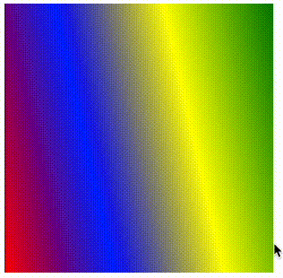

# variable
自定义属性（有时候也被称作CSS变量或者级联变量）,它包含的值可以在整个文档中重复使用由自定义属性标记设定值
``` css
:root{--main-color:black;}
.home{color:var(--main-color)}
```

CSS变量带来的提升绝不仅仅是节约点CSS代码，以及降低CSS开发和维护成本。

更重要的是，把组件中众多的交互开发从原来的JS转移到了CSS代码中，让组件代码更简洁，同时让视觉表现实现更加灵活了。

## 基本操作

如果我们要实现一个进度条，按照传统的方法，获取到进度，然后通过`Dom.style.xxx = ''`去设置，如果有多个地方用到了这个值，就需要多次设置。

如果使用变量的话就会很简单

``` html
<style>
:root{  --width:0;  }

div{
  /* .... */
  width: calc(1% * var(--percent));
}
</style>
<!-- 省略 -->
<script>
// 设置变量
document.documentElement.style.setProperty('--percent',0)
</script>
```

## 可以控制伪类样式
我们知道js是无法获取到一个元素的伪类，然后去**直接修改**他的样式的。

变量提供了一种更方便的方式去修改样式。

``` html
<style>
:root{  --width:0;  }

div::before{
  /* .... */
  content:'';
  width: calc(1% * var(--percent));
}
</style>
<!-- 省略 -->
<script>
// 设置变量
document.documentElement.style.setProperty('--percent',0)
</script>
```

## 与js结合做一些效果

### 点击页面任意一点出现文字


``` css
:root{
  --x:0;
  --y:0;
}

body:active::after {
    transform: translate(-50%, -100%);
    opacity: 0.5;
    transition: 0s;
    left: -999px;
}

body::after {
    content: attr(text);
    position:fixed;
    z-index: 999;
    left: calc(var(--x, -999) * 1px);
    top: calc(var(--y, -999) * 1px);
    transform: translate(-50%, calc(-100% - 20px));
    opacity: 0;
    transition: transform .3s, opacity .5s;
}
```

而且还可以通过attr属性来修改需要展示的内容。

### 按钮按压扩散效果

点击按钮的时候有个圈圈放大的效果，圈圈放大的中心点就是点击的位置。

<iframe height="300" style="width: 100%;" scrolling="no" title="button" src="https://codepen.io/WFFMLOVE/embed/ExgKJeb?default-tab=html%2Cresult&editable=true" frameborder="no" loading="lazy" allowtransparency="true" allowfullscreen="true">
  See the Pen <a href="https://codepen.io/WFFMLOVE/pen/ExgKJeb">
  button</a> by 1998yyh (<a href="https://codepen.io/WFFMLOVE">@WFFMLOVE</a>)
  on <a href="https://codepen.io">CodePen</a>.
</iframe>

# @property
@property CSS at-rule 是 CSS Houdini API 的一部分, 它允许开发者显式地定义他们的 CSS 自定义属性，允许进行属性类型检查、设定默认值以及定义该自定义属性是否可以被继承。

## 基本操作

```html
<style>
@property --myColor {
  syntax: '<color>';
  inherits: false;
  initial-value: #fff;
}

p {
  color: var(--myColor);  
}
</style>
```


+ `@property --myColor` 中的 `--myColor` 就是自定义属性的名称，定义后可在 CSS 中通过 var() 进行引用
+ syntax:该自定义属性的语法规则，也可以理解为表示定义的自定义属性的类型 [具体规则链接](https://developer.mozilla.org/zh-CN/docs/Web/CSS/@property/syntax)
+ inherits:是否允许继承
+ initial-value:初始值

## 结合渐变达到过度效果

我们都知道渐变作为背景时，是一张图片，是无法进行颜色的过渡变化的。

一些特定的场景下我们可以使用`hue-rotate`或者改变`background-position`来实现特定的效果，但是不具有普遍性。

而`@property`能够帮助我们实现。


 
<!--   -->


实现的相关代码如下

``` html
<style>
  @property --color-red{
    syntax: '<color>';
    inherits: false;
    initial-value: red;
  }
  @property --color-blue{
    syntax: '<color>';
    inherits: false;
    initial-value: blue;
  }

  @property --color-yellow{
    syntax: '<color>';
    inherits: false;
    initial-value: yellow;
  }

  @property --color-green{
    syntax: '<color>';
    inherits: false;
    initial-value: green;
  }


  div{
    width: 300px;
    height: 300px;
    background-image: linear-gradient(45deg,var(--color-red),var(--color-blue),var(--color-yellow),var(--color-green));
    transition: 1s --color-red,1s --color-blue,1s --color-yellow, 1s --color-green;
  }

  div:hover{
    --color-red:blue;
    --color-blue:yellow;
    --color-yellow:green;
    --color-green:blue;

  }
</style>
```

## 其他

我们可以再想想还有哪些属性原本是不支持过渡的

比如:`linear-gradient`的角度。

<!--  -->



再或者是:`conic-gradient`的百分比。


还有`text-underline-offset`


## 最后
其他不支持过渡的属性应该还有很多，可以自行尝试。

相关资料:[https://github.com/chokcoco/iCSS/issues/109](https://github.com/chokcoco/iCSS/issues/109)